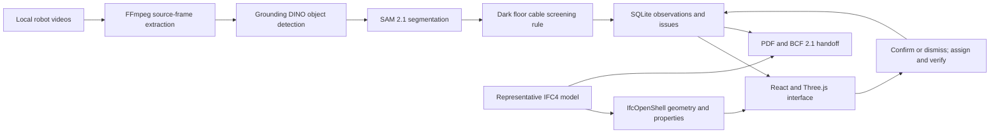

# Fieldlink — robot evidence + BIM

A local construction-monitoring demonstration built around ten robot-captured factory recordings. Fieldlink automatically detects candidate dark cables, generates segmentation masks, and creates issues linked to a representative IFC model. Reviewers confirm or dismiss issues that already exist, then assign follow-up. SQLite preserves source provenance and history; exports include PDF, BCF 2.1, IFC, original evidence images, and generated highlights.

The demo presents a foundation for construction project monitoring: turn repeated site captures into actionable, traceable findings associated with building objects and spaces. The current footage demonstrates the issue workflow. Measuring construction completion requires project-specific BIM, schedule, registered capture locations, repeat visits, and validated completion rules.

Repository: [tpp6me/quadreped_bim_integration](https://github.com/tpp6me/quadreped_bim_integration). The remote repository uses `quadreped`; the existing local workspace directory uses `quadraped`.

## Contents

- [Run an already prepared workspace](#run-the-demo)
- [Fresh clone and data preparation](#fresh-setup-and-reproducible-data-preparation)
- [Presentation walkthrough](#demo-flow)
- [Architecture and technology](#architecture-and-technology)
- [Automatic detection and highlights](#automatic-detection-and-highlights)
- [IFC, BCF, and handoff contents](#ifc-bcf-and-handoff-contents)
- [Issue lifecycle and stored records](#issue-lifecycle-and-stored-records)
- [Configuration](#configuration)
- [API reference](#api-reference)
- [Verification](#verification)
- [Narrated demo video](#narrated-demo-video)
- [Troubleshooting](#troubleshooting)
- [Moving from demo to a construction pilot](#moving-from-demo-to-a-construction-pilot)
- [Repository contents and project structure](#repository-contents-and-project-structure)

## Run the demo

For a workspace whose dependencies, media, evidence, and local vision models are already prepared:

```sh
npm run build
npm run server
```

Open **http://127.0.0.1:8000**. The server binds to localhost. Original videos remain in `/Users/praveen/Downloads/OneDrive_1_5-10-2026` and are streamed with byte-range support; they are not copied into the application bundle.

For a different media folder:

```sh
FIELDLINK_MEDIA_DIR=/path/to/recordings npm run server
```

The source filenames must match `data/media.json`. Use `FIELDLINK_PORT` to select another port. Review data lives in `data/fieldlink.sqlite`; preserve this file to retain the demo state. `FIELDLINK_DB` selects an alternate database for a separate presentation or test run.

## Demo flow

1. Start the server and open **Site overview**. Analysis starts automatically, using full-resolution samples every 15 seconds plus six indexed evidence frames (87 frames for the supplied set).
2. Automatic findings arrive with detection boxes, segmentation masks, model scores, source timestamps, and an issue in **Needs review**. There is no drawing or issue-creation step for the reviewer.
3. Open **Review FL-001** or the issue register. Compare the highlighted frame with **Show original**. Confirm the finding by choosing **Open** and entering a review note, or choose **Dismissed** with a reason.
4. Assign the confirmed issue to a demonstration team with a due date. Resolve only with follow-up evidence; close only after verification.
5. Download the PDF, BCF, or ZIP from **Reports & handoff**. Pending and reviewed findings retain their respective states in the handoff.

The model viewer also opens the original clip at the issue timestamp. Its location is a representative clip-to-space mapping, not measured robot localization. **Correct highlight (optional)** is available for exceptions; it is not part of automatic issue generation. The six original curated observations remain available as reference material and for manual entry.

Analysis runs on startup and can be rerun with **Check recordings**. Unchanged inference results are reused from a cache keyed by image hash, model revisions, prompt, threshold, and pipeline version. Matching frame results are persisted once. Overlapping detections in nearby samples from the same clip are grouped; this is limited temporal deduplication, not cross-camera tracking. Confirmed or dismissed issues are not reset on rerun. Processing errors are visible and never produce fabricated findings.

## What is implemented

- Ten original recordings, thumbnails, source metadata and SHA-256 hashes.
- Automatic Grounding DINO detection, SAM 2.1 segmentation, and issue creation before human review.
- Six additional curated observations with exact source timestamps and full-resolution evidence frames.
- Four tagged spaces, a named level, IFC grid axes, and 38 geometric elements in the representative model.
- Orbit, plan view, envelope toggle, element selection, and linked video seeking. Orange markers represent evidence, not defects or completion.
- Curated tag/description search, space filtering, and a no-result state.
- Editable review decisions and persisted issue assignment, resolution, verified closure, reopening, and history.
- Server validation for required assignment fields, resolution evidence, workflow transitions, and stale edits.
- PDF punch list with images, source references, model views, and activity history.
- BCF 2.1 export with schema validation, stable topic IDs, IFC element references, a model camera, separate source evidence, and snapshots.
- Complete handoff ZIP and export history.
- Responsive layouts and a prerecorded browser walkthrough under `data/exports/verification/` after running the browser checks.

## Boundaries

This is a **local, single-project demo**, not a hosted production service. Reviewer and assignee names are entered labels, not authenticated identities. No external notifications are sent. Do not expose the server to a public network without adding authentication, access controls, and deployment hardening.

The footage shows an operating factory; the industrial-handover story and model locations are illustrative. Capture dates and recording chronology are unknown. Search matches stored tags and descriptions from curated and automatically generated observations. Automatic detection and segmentation are separate local model inference steps. Construction progress, automatic localization, measured clearances, commissioning acceptance, and change detection are not inferred from these videos.

**Independent BIM application verification is pending.** The user confirmed no BIM tool is available. The exporter validates against buildingSMART BCF 2.1 XML schemas, and tests verify references against the actual IFC. These checks do not prove compatibility with every receiving application. See the manifest and `READ-ME.txt` in each handoff bundle.

Before external distribution, confirm footage reuse rights and select or redact presentation media as appropriate. No public upload or deployment is performed by this project.

## Fresh setup and reproducible data preparation

### Prerequisites

| Dependency | Purpose |
| --- | --- |
| Node.js 20+ and npm | Frontend development, production build, and Playwright scripts |
| Python 3.11+ with `venv` | API, IFC authoring, image processing, and local inference |
| FFmpeg and ffprobe on `PATH` | Video inventory, frame extraction, and video rendering |
| The original ten recordings | Media playback, evidence extraction, and automated analysis |
| Internet access during installation | npm/Python dependencies and the pinned public model weights |
| Google Chrome | Optional browser verification and narrated walkthrough rendering |
| macOS `say` and PyMuPDF | Optional narration generation and PDF previews for the video |

The normal application does not require a commercial BIM tool, a cloud account, or an API key. CPU inference is the default. Model weights use roughly 0.8 GB of disk space; allow additional room for Python packages, sampled frames, caches, and exports. Initial inference is slower than a rerun that reuses cached results.

### Clone and install

```sh
git clone git@github.com:tpp6me/quadreped_bim_integration.git
cd quadreped_bim_integration
python3 -m venv .venv
.venv/bin/python -m pip install -r requirements-vision.txt
npm ci
```

`requirements-vision.txt` includes the base API dependencies plus pinned PyTorch, torchvision, and Transformers versions. For development of only the manual review and export features, install `requirements.txt` instead and start the API with `FIELDLINK_AUTORUN=0`.

### Supply the recordings

The original recordings and images extracted from them are excluded from Git. Set the media folder in every terminal used for preparation, the server, or media-dependent tests:

```sh
export FIELDLINK_MEDIA_DIR="/absolute/path/to/recordings"
```

The supplied demonstration dataset uses these filenames:

```text
BV_Sample1.mp4
BV SAMPLE 2.mp4
BV SAMPLE 3.mp4
BV SAMPLE 4.mp4
BV SAMPLE 5.mp4
BV SAMPLE 6.mp4
BV SAMPLE 7.mp4
BV SAMPLE 8.mp4
BV SAMPLE 9.mp4
BV SAMPLE 10.mp4
```

Filename matching is exact. `prepare_media.py` currently inventories these ten files; `prepare_evidence.py` and the seeded observations also assume this dataset. Supporting a different set of recordings requires changing the inventory, curated observation offsets, and representative clip-to-space assignments rather than simply pointing to an arbitrary directory. The bundled `data/media.json` documents the supplied set; it does not include the video contents.

### Prepare data and start

```sh
.venv/bin/python scripts/prepare_vision.py
.venv/bin/python scripts/prepare_media.py
.venv/bin/python scripts/prepare_demo.py
.venv/bin/python scripts/prepare_evidence.py
npm run build
npm run server
```

Open **http://127.0.0.1:8000**. Automatic analysis starts in a background worker after the API initializes its database.

| Preparation script | Output |
| --- | --- |
| `prepare_vision.py` | Pinned detector and segmenter weights plus `data/models/registry.json` |
| `prepare_media.py` | SHA-256 inventory in `data/media.json`, small frames every five seconds, and contact sheets |
| `prepare_demo.py` | Representative IFC4 and IFC-derived triangulated geometry with deterministic GlobalIds |
| `prepare_evidence.py` | Exact source evidence images and thumbnails for the database observations |

Original files remain unchanged. `prepare_evidence.py` seeds the six curated observations when the database is new; on an existing database it extracts frames for the observations already stored there. Preserve the database and its corresponding evidence images together when keeping a presentation state.

The representative model and schema files are included in Git. Regenerating the model is optional for a fresh clone unless you are changing its geometry.

### Frontend development

Run the API and Vite in separate terminals after preparing the data:

```sh
# Terminal 1: use the same FIELDLINK_MEDIA_DIR as preparation.
npm run server

# Terminal 2
npm run dev
```

Vite serves **http://127.0.0.1:5173** and proxies `/api`, `/media`, and `/assets-data` to port 8000. The built frontend is served directly by FastAPI at port 8000. If the API port changes during frontend development, update the proxy targets in `vite.config.js` as well.

## Architecture and technology



| Component | Implementation |
| --- | --- |
| Interface | React 19, Vite 6, Lucide icons, responsive CSS |
| Model viewer | Three.js renders geometry extracted from the IFC by IfcOpenShell |
| API | FastAPI and Uvicorn, bound to `127.0.0.1` |
| Persistence | SQLite tables containing versioned JSON records |
| Media processing | FFmpeg/ffprobe and Pillow |
| Automatic vision | PyTorch, Transformers, Grounding DINO tiny, SAM 2.1 Hiera tiny |
| Optional highlight correction | OpenCV GrabCut or an explicitly labelled manual box |
| Handoff | ReportLab PDF, BCF XML validated by lxml, ZIP packaging |
| Verification | Python unittest integration checks and Playwright browser workflows |

The API streams originals with byte-range support. The analysis worker extracts full-resolution source frames and uses the detector's boxes as segmentation input. A qualifying prediction is persisted as an observation and issue in one database transaction. The interface polls analysis and project state so generated findings appear without manual creation.

There is one in-process analysis worker and a local database. The project has no distributed queue, robot fleet connection, authenticated multi-user service, or cloud BIM connector. The browser viewer loads the generated `model.json`; arbitrary IFC upload and conversion are not implemented.

## Configuration

Set configuration through the shell environment; the application does not load `.env` files automatically.

| Variable | Default | Purpose |
| --- | --- | --- |
| `FIELDLINK_MEDIA_DIR` | `/Users/praveen/Downloads/OneDrive_1_5-10-2026` | Folder containing the original recordings |
| `FIELDLINK_PORT` | `8000` | FastAPI port; host remains localhost |
| `FIELDLINK_DB` | `data/fieldlink.sqlite` | SQLite file for observations, issues, analyses, and export history |
| `FIELDLINK_AUTORUN` | `1` | Start analysis on server startup; set `0` to disable startup analysis |
| `FIELDLINK_ANALYSIS_CACHE` | `data/analysis-cache` | Location of versioned inference-result JSON files |
| `FIELDLINK_VISION_DEVICE` | `cpu` | PyTorch device; other values require compatible hardware and dependencies |
| `FIELDLINK_TEST_PORT` | `8001` | Port used by the manual browser workflow |
| `FIELDLINK_BROWSER_CHANNEL` | `chrome` | Playwright browser channel used by the manual browser workflow |
| `FIELDLINK_VOICE` | `Samantha` | macOS voice used by narration preparation |
| `FIELDLINK_SPEECH_RATE` | `165` | Narration speed in words per minute |

The automatic browser workflow uses port **8003**, and the narrated renderer uses **8002**. These scripts currently launch Chrome and use fixed ports. Model paths are fixed under `data/models/`; the pinned repositories and revisions are defined in `scripts/prepare_vision.py`.

For a separate review session:

```sh
FIELDLINK_DB=/absolute/path/to/demo-session.sqlite npm run server
```

An alternate database isolates review records, but evidence files and the default inference cache remain in the shared project data directories. Model predictions can be reused across sessions; session issue records are created separately. Back up SQLite while the server is stopped, together with `data/evidence/`, `data/media.json`, `data/model.json`, and `data/representative.ifc`.

## Issue lifecycle and stored records

Automatic findings are created by **Fieldlink vision** with status `needs_review`, a generated box and segmentation mask, and no human reviewer. The reviewer never needs to create that issue or draw its initial highlight.

| Status change | Requirement |
| --- | --- |
| `needs_review` → `open` | Reviewer name and a note confirming the candidate finding |
| `needs_review` → `dismissed` | Reviewer name and a reason for rejecting the finding |
| `dismissed` → `needs_review` | Return the finding to review |
| `open` → `assigned` | Responsible party and a valid due date |
| `assigned` → `resolved` | Assignment fields, supporting evidence reference, and a note |
| `resolved` → `closed` | Assignment fields, supporting evidence reference, and a verification note |
| `closed` → `open` | A reason for reopening |

The API also supports returning an assigned issue to open and a resolved issue to assigned. It rejects invalid shortcuts. Record revisions prevent stale edits from silently overwriting newer state; refresh after a `409` response.

Resolution evidence is a text reference entered by the reviewer. The demo does not upload corrective-work attachments or independently assess that evidence. Reviewer and assignee names are entered labels, without authentication or external notifications.

SQLite stores four tables:

| Table | Stored information |
| --- | --- |
| `observations` | Source clip and offset, descriptions, tags, model element, generated highlight, review provenance, and history |
| `issues` | Stable topic GUID, workflow status, priority, discipline, assignment, due date, and activity history |
| `analyses` | Per-frame source hash, model versions, pipeline version, detection counts, and created issue IDs |
| `exports` | Export type, filename, time, included issue IDs, and interoperability status |

The six curated observations support reference browsing and a separate manual entry workflow. Manual issue creation requires confirming the observation first. This does not gate the automatic pipeline, which creates its own issues before review.

## IFC, BCF, and handoff contents

**IFC (Industry Foundation Classes)** carries the building model: geometry, spaces, objects, and properties. This repository supplies a representative IFC4 model with four spaces and 38 geometric elements, including equipment, storage racks, structure, and envelope elements. It is a demonstration model, not an as-built reconstruction of the footage.

**BCF (BIM Collaboration Format)** carries issues associated with that model: topic metadata, status, comments, selected IFC elements, viewpoints, and supporting documents. Fieldlink exports BCF **2.1**. The full building geometry travels in the companion IFC file.

| Download | Contents |
| --- | --- |
| PDF | Punch list with source timestamps, generated highlights, original views, model references, and activity history |
| BCF | Schema-validated topics, IFC GlobalId references, model cameras and snapshots, source evidence, and highlight metadata |
| IFC | The representative building model |
| ZIP | `fieldlink-punch-list.pdf`, `fieldlink-issues.bcfzip`, `representative.ifc`, `manifest.json`, and `READ-ME.txt` |

For an issue with a highlight, its BCF topic includes `highlighted.png`, `source-original.jpg`, and `highlight.json`. The separate `evidence.png` carries a source-frame annotation; `snapshot.png` depicts the representative model viewpoint. Original video files are not included in the handoff. Clip filenames, source offsets, hashes, and model provenance are retained in the manifest.

BCF field mappings are `discipline` → `Labels`, `priority` → `Priority`, and workflow status → `TopicStatus`. Stable issue GUIDs allow repeat exports to refer to the same topic. The demo retains `needs_review` and `dismissed` states explicitly; receiving tools may need matching status configuration.

To test interoperability, load `representative.ifc` into a compatible receiving application, import `fieldlink-issues.bcfzip`, and check element selection, camera orientation, snapshots, attachments, statuses, comments, and assignments. XML schema and IFC-reference validation are implemented; independent receiving-application import is still pending.

## API reference

FastAPI exposes interactive documentation at **http://127.0.0.1:8000/docs** and the OpenAPI schema at `/openapi.json`.

| Method | Path | Purpose |
| --- | --- | --- |
| GET | `/api/health` | Basic server health and media-directory availability |
| GET | `/api/project` | Model, videos, observations, issues, exports, and current analysis state |
| GET | `/api/analysis` | Worker progress, errors, model availability, and sampling interval |
| POST | `/api/analysis/run` | Start or rerun automatic analysis; requires local models |
| GET | `/api/search?q=cables` | Match indexed tags and descriptions; no inference on this endpoint |
| PATCH | `/api/observations/{id}` | Review or edit a curated observation using its revision |
| POST | `/api/issues` | Create an issue from a confirmed manual observation |
| PATCH | `/api/issues/{id}` | Review an existing automatic issue or update its lifecycle |
| POST | `/api/observations/{id}/segment` | Preview an optional reviewer-guided segmentation correction |
| PATCH | `/api/observations/{id}/highlight` | Save or remove an optional highlight correction |
| GET | `/media/{video_id}` | Stream the original recording with range support |
| GET | `/api/exports/{kind}` | Download `pdf`, `bcf`, `bundle`, or `ifc` |
| GET | `/api/explainer` | Open the standalone business explainer |

For example, with the server running:

```sh
curl -sS http://127.0.0.1:8000/api/analysis
curl -sS -X POST http://127.0.0.1:8000/api/analysis/run
curl -f -o fieldlink-handoff.zip http://127.0.0.1:8000/api/exports/bundle
```

PDF, BCF, and bundle exports require at least one issue. API errors distinguish missing records or media (`404`), stale edits (`409`), invalid workflow or fields (`422`), and unavailable vision models (`503`). Mutating requests with a mismatched browser origin are rejected (`403`). This origin check is not authentication.

## Verification

```sh
npm test
npm run build
npm run test:browser
node tests/automatic-browser.mjs
# Record a slower walkthrough with step captions:
npm run test:browser -- --record
```

The Python integration tests cover search, review requirements, optimistic concurrency, the full issue lifecycle, media ranges, origin checks, PDF/BCF packaging, XML schemas, and IFC references. The browser checks exercise review-to-export, persistence after reload, all ten source clips, four app views at five viewport widths, and runtime errors. They start an isolated API on port 8001 and use installed Google Chrome; set `FIELDLINK_TEST_PORT` or `FIELDLINK_BROWSER_CHANNEL` if needed.

Run these commands after preparing evidence and setting `FIELDLINK_MEDIA_DIR`. The suite intentionally uses source images and tests playback of the supplied videos; it is not a media-free smoke test for a fresh clone. Test databases are temporary, while derived evidence and artifacts use the local data directories. The automatic browser workflow additionally requires the real local detector and segmenter weights.

Automation unit tests use explicitly synthetic inference outputs to verify persistence, deduplication, triage, negative results, and failure handling. The real-model browser workflow verifies generated masks and issue creation before reviewer input. Passing workflow tests does not establish model accuracy on construction sites.

Browser artifacts include screenshots, a sample handoff with demonstration assignments, a check report, and `fallback-walkthrough.webm`. The recording is labelled as prerecorded and does not include independent BIM-tool import. It is an application walkthrough, not a narrated seven-minute presentation.

## Narrated demo video

The generated presentation video is `data/exports/narrated/fieldlink-automatic-workflow-demo.mp4`: approximately two minutes and 46 seconds, 1920 × 1080, with synchronized synthetic English narration and visible captions. A close-up reveals the actual saved detection box, segmentation mask, and automatically created issue in sequence, before any human review. The application walkthrough then demonstrates comparison, human triage, BIM context, assignment, and the actual exported report. It also explains the additional inputs needed for construction progress monitoring.

Generated subtitles are saved as `fieldlink-automatic-workflow-demo.srt`, and `transcript.txt` contains the narration. The earlier `fieldlink-narrated-demo.mp4` filename is updated with the same recording. Videos, subtitles, reports, and other derived recording artifacts are local outputs excluded from Git; clone the source and regenerate them with access to the original media.

To regenerate on macOS after building the app and preparing its data:

```sh
# Optional video-rendering dependency in the interpreter used below:
python3 -m pip install PyMuPDF
python3 scripts/prepare_narration.py
node scripts/render_narrated_demo.mjs
```

This requires macOS `say` (Samantha voice by default), FFmpeg, Google Chrome, and PyMuPDF available to `python3`. Edit `scripts/narration.json` to change the script. The renderer uses an isolated temporary database on port 8002 and times the interface actions and captions against the generated speech; existing demo reviews are preserved. Output files are under `data/exports/narrated/`.

## Automatic detection and highlights

`server/vision.py` runs **Grounding DINO tiny** and **SAM 2.1 Hiera tiny** locally. Models use pinned public revisions downloaded by `scripts/prepare_vision.py`; no factory frames are uploaded, and inference does not execute remote model code. CPU is the default; model weights occupy approximately 850 MB. Missing models produce an explicit unavailable state. For lightweight manual-only development, set `FIELDLINK_AUTORUN=0`; this also isolates the manual browser checks.

The current configurable-in-code check is deliberately specific: **possible dark cables near the floor**. Grounding DINO uses the class prompt `a black cable.` with a detection-score threshold of 0.40. Its boxes are passed directly to SAM 2.1, without reviewer points or strokes. The screening rule requires the box centre in the lower 45% of the image, at least 80% of the mask in the lower half, at least 20% dark pixels, and at most 30% saturated paint-coloured pixels. These filters reduce observed painted-route false positives. They are image-space heuristics, not floor reconstruction or proof of an obstruction. The rule, model versions, scores, image hashes, and generated time are preserved with each issue.

This is a working automatic pipeline for one demonstrated check, not a validated general construction-defect detector. False positives (including joints or shadows), missed objects, lighting effects, and blind intervals between sampled frames remain possible. Neither detection scores nor mask-quality estimates are calibrated hazard probabilities. A construction pilot should independently measure precision/recall on labelled project footage before adding other checks or relying on automated alerts. No measured progress or video-mask tracking is claimed.

Generated highlights persist automatically. Human review happens afterwards, and optional corrections use local GrabCut or a clearly labelled manual box. Original image data stays unchanged. PDF exports include the highlight and a separate original view; BCF retains the model viewpoint and includes `highlighted.png`, `source-original.jpg`, and `highlight.json`. Automated and human review provenance are labelled separately, including when an issue has not yet been reviewed.

The narrated recording uses the automatic pipeline with an isolated database. It may reuse previously computed, versioned inference results for repeatability; that is disclosed onscreen. It never loads hand-drawn coordinates from the earlier assisted-highlighting example. Real-model browser verification is in `tests/automatic-browser.mjs`; workflow unit tests use explicitly synthetic model outputs and test automatic creation, negative findings, deduplication, triage, and failure handling separately.

Model documentation: [Grounding DINO](https://huggingface.co/IDEA-Research/grounding-dino-tiny), [SAM 2.1](https://huggingface.co/facebook/sam2.1-hiera-tiny).

## Troubleshooting

| Symptom | Check or action |
| --- | --- |
| Root page is missing or returns 404 | Run `npm run build` before starting/restarting the API; FastAPI mounts `dist/` when imported |
| Clips are unavailable | Export `FIELDLINK_MEDIA_DIR` in the server terminal and check the exact filenames in `data/media.json` |
| Thumbnails or evidence images are missing | Run `prepare_media.py` and `prepare_evidence.py` with the correct recordings |
| Automatic analysis is unavailable | Install `requirements-vision.txt`, run `prepare_vision.py`, and check `data/models/registry.json` and both weight files |
| Analysis stops with errors | Read `/api/analysis`; the worker stops after three frame-processing failures and does not invent results |
| First analysis is slow | CPU inference and loading the model weights take time; inspect processed-frame counts rather than refreshing the server |
| Rerun creates no new issues | Identical frame analyses are persisted once; nearby overlapping detections may also match existing issues |
| Saving returns `409` | Reopen or refresh the record; its revision changed after your form was opened |
| Assignment or closure is rejected | Follow the lifecycle and provide its required assignee, due date, note, and evidence reference |
| Export fails on an image | Restore the evidence associated with the database, or regenerate it from the original clip and timestamp |
| Browser check cannot start | Install Chrome and ensure ports 8001/8003 are available; automatic checks also require the real model weights |
| Narrated renderer cannot start | Ensure port 8002 is free and Chrome, FFmpeg, macOS `say`, and PyMuPDF are available |
| Vite can load but API requests fail | Start the API at port 8000 or adjust the Vite proxy to the configured API port |

The supplied dataset's first generated cable finding is anchored to `v10` at **01:42**. The narrated renderer expects this finding as `FL-001` in its fresh recording database; changes to sampling, rules, or source media may require adjusting the script.

## Moving from demo to a construction pilot

| Step | Additional work and evidence needed |
| --- | --- |
| Use the actual project model | Import/convert its BIM geometry, preserve object identifiers, establish model version handling, and verify issue exchange in the team's receiving tool |
| Register robot captures | Connect camera poses or surveyed capture points to project coordinates and retain capture dates and route metadata |
| Define site checks | Select specific defect or safety classes with the project team, collect labelled examples, and measure detection and segmentation accuracy |
| Connect planned work | Map model elements to schedule activities, quantities, milestones, and agreed completion criteria |
| Measure progress over time | Compare repeat captures using registered viewpoints and independently validated completion evidence; report coverage and uncertainty |
| Integrate issue handling | Add the customer's authenticated issue platform, attachment handling, assignment mappings, permissions, and notifications |
| Operate reliably | Add ingestion jobs, retries, monitoring, audit controls, concurrent-user support, deployment, and backup/retention policies |

This roadmap describes future work. The running demo implements local evidence analysis and issue management for one cable screening check; it does not calculate project completion percentages or synchronize with a commercial BIM platform.

## Repository contents and project structure

Git tracks application source, dependency lockfiles, tests, documentation, narration scripts, the representative IFC and geometry JSON, the source metadata manifest, and BCF validation schemas. It excludes dependencies, frontend build output, SQLite state, model weights, inference caches, extracted factory images, original recordings, and generated handoff/video artifacts. A fresh clone needs local preparation before the full demo and media-dependent checks can run.

| Path | Purpose |
| --- | --- |
| `src/` | React interface and Three.js IFC geometry viewer |
| `server/` | FastAPI, SQLite records, media streaming, PDF and BCF export |
| `scripts/` | Media inventory and evidence/model generation |
| `scripts/narration.json` | Spoken walkthrough and chapter titles |
| `scripts/render_narrated_demo.mjs` | Chrome capture, synchronized captions, and FFmpeg encoding |
| `data/representative.ifc` | Shareable representative IFC4 model |
| `data/model.json` | IFC-derived browser geometry and element properties |
| `data/media.json` | Source manifest with hashes and unknown capture dates |
| `data/schemas/` | buildingSMART BCF 2.1 validation schemas |
| `data/evidence/` | Local exact source evidence; excluded from Git |
| `data/models/` | Downloaded model weights and revision registry; excluded from Git |
| `data/analysis-cache/` | Versioned inference results; excluded from Git |
| `data/fieldlink.sqlite` | Local observations, issues, analyses, and export history; excluded from Git |
| `data/exports/` | Generated videos, browser verification, and handoff artifacts; excluded from Git |
| `tests/` | Backend integration checks and isolated browser walkthrough |
| `docs/robodog-bim-demo-plan.md` | Agreed scope and presentation plan |
| `docs/robodog-construction-monitoring.html` | Standalone business explainer |
| `docs/robodog-bim-demo-plan-review.md` | Review feedback used to refine the demonstration |

BCF schema source: [buildingSMART BCF-XML, release_2_1](https://github.com/buildingSMART/BCF-XML/tree/release_2_1/Schemas). IFC authoring: [IfcOpenShell](https://docs.ifcopenshell.org/). Browser model geometry is rendered with [Three.js](https://threejs.org/).

Third-party dependencies, schemas, and model weights have their own licenses and terms. No project license is assigned by this README. The source manifest records file hashes and unknown capture dates; it does not grant rights to redistribute the original factory footage.
