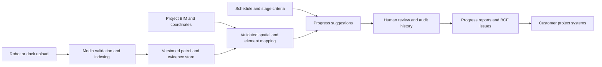

# Robodog + BIM Construction Monitoring Demo Plan

Updated: 6 October 2026. The local Fieldlink demo is implemented; this document retains the agreed scope and presentation plan. See [README](../README.md) for running it and for implemented capabilities.

Current implementation: local object detection and segmentation automatically create highlighted candidate issues before human review. Grounding DINO + SAM 2.1 screen full-resolution video samples for possible dark floor cables. Reviewers confirm, dismiss, or optionally correct findings, then assign follow-up. The generated IFC4 model and PDF/BCF/IFC handoff exports remain in place. The selected cable example is clip 10 at 01:42; the dark line in clip 8 was not retained as cable evidence after full-resolution inspection. No actual construction progress is inferred.

The user confirmed that no BIM application is available. Independent receiving-tool verification and its demonstration beat are therefore pending; deliver schema-validated BCF and the companion IFC with that limitation documented. Until a receiving tool is available, use the export contents and reference-validation results for the interoperability segment, without claiming successful external import.

## 1. Objective and presentation position

Present a credible path from robot-captured evidence to construction monitoring: recorded walkthrough → automatic detection and segmentation → automatically created issue with highlighted evidence and BIM context → human triage → assignment → report and BIM issue export.

The immediate demonstration is **industrial-facility handover and punch-list management**, an accessible entry point for construction companies. Use the existing factory footage to illustrate that workflow. It is footage of an operating factory, not evidence that this facility is under construction or undergoing commissioning. Label the scenario accordingly.

The wider product vision is progress monitoring across construction projects. Actual planned-versus-built reporting requires a project model, linked schedule, defined completion criteria, repeat captures, and validated location mapping. The first demo establishes evidence management and interoperability; any construction progress examples remain explicitly simulated.

Presenter opening:

> We automatically detect candidate problems in robot footage, segment the evidence, and create BIM-linked issues. Project teams review findings that already exist and trace decisions back to a location and video timestamp. This demo uses factory recordings and a representative industrial-building model to illustrate a handover workflow. A construction pilot adds the actual model, schedule, and repeat site captures for progress verification.

## 2. Available evidence and decisions

- Source: `/Users/praveen/Downloads/OneDrive_1_5-10-2026`.
- Ten MP4 files: `BV_Sample1.mp4` and `BV SAMPLE 2.mp4` through `BV SAMPLE 10.mp4`.
- Approximately 20 minutes in total; 1920 × 1080 at 30 fps.
- Initial inspection examined metadata and three sampled frames per video. Full curation remains to be done.
- Samples show machinery, racks, assembly areas, marked aisles, pallets, workers, and cables across some floor areas.
- No actual project BIM has been supplied. The user selected a representative model.
- Inspected container metadata did not supply a verified capture date. Editor metadata is present; clip numbering and similar durations do not establish recording order or an uninterrupted patrol.

Retain original media unchanged. Derive thumbnails and presentation clips separately. Use clip-relative timestamps for evidence references. Keep `captured_at` and `recording_device` unknown until documented; store file/download dates separately rather than treating them as patrol time. Capture timezone and source when a date is supplied.

## 3. Scope and priorities

| Capability | First-demo deliverable | Priority |
| --- | --- | --- |
| BIM-linked walkthrough | Select a tagged space or element to open evidence; playback highlights its manually mapped location. | Core |
| Searchable evidence | Search curated tags/descriptions for a few useful queries; results show frames, filenames, and timestamps. | Core minimum |
| Automatic issue generation | Detect candidate objects, generate masks, and create issues with evidence before reviewer action. | Core / implemented for dark cables |
| Issue review | Confirm, dismiss, or optionally correct automatically created findings. | Core |
| Element evidence register | Reuse the selected-element panel to list related captures, observations, and issues. | Core |
| Construction issue workflow | Discipline, priority, responsible party, due date, comments, and verified closure. | Core |
| PDF punch list + BCF 2.1 export | Export traceable issues and demonstrate them in one independently tested BIM/BCF application. | Core |
| Semantic search | Precompute image/text embeddings and validate retrieval beyond curated tags. | Stretch |
| Coverage and route animation | Evidence coverage or an illustrative route overlay. | Optional |
| Change detection and measured progress | Actual repeat-location comparison and schedule-linked progress. | Construction pilot |
| APS/ACC or Procore connections | Authenticated integration with a customer's project system. | Later integration |

Under time pressure, cut route animation and coverage first, then semantic search and additional model detail. Preserve basic search, evidence review, IFC/BCF interoperability, reporting, and provenance. Do not describe curated tag search as semantic AI retrieval.

## 4. Step zero: curate a reliable evidence set

1. Inventory all ten files: duration, resolution, source identifier/hash, metadata, and available audio tracks. Preserve source identity through derivatives.
2. Produce contact sheets at roughly one frame every five seconds (about 240 frames), supplemented by scene-change sampling. Watch candidate clips in motion and inspect their full-resolution frames.
3. Select four to six visually legible observations. An observation may simply document a condition; do not manufacture defects to reach a quota. Record its clip, time range, best frame, visibility limits, proposed location, and reviewed wording.
4. Investigate the cables seen in samples from clips 8 and 10 as candidates. Confirm context before using “possible access obstruction”; the presence of a cable alone does not establish a hazard.
5. Check overlaps, continuity, and repeated areas visually. Repeated views within these clips may illustrate evidence comparison, but cannot establish progress over days or weeks without reliable chronology.
6. Prepare three to five search queries, such as “cables on floor,” “storage racks,” and “marked aisle.” Check that each returns relevant evidence; include an unsupported query that returns no useful result.
7. Prefer presentation segments without identifiable workers. Before external redistribution, confirm permitted use and prepare appropriate redacted derivatives if needed. This is presentation preparation, not a prerequisite to local implementation.

Deliverable: a media manifest, curated observation list, query-to-result reference set, and presentation-ready evidence derivatives. If the material supports fewer findings, narrow the narrative instead of inventing observations.

## 5. Representative BIM model and interoperability

Create a compact IFC industrial building with a shell, floor, columns, roof, and approximately 15–25 simplified equipment or building elements.

- Use a named building and a storey such as `L00 — Ground Floor`.
- Include grid axes `A–D` and `1–4`, with intersection references such as `B2`.
- Tag four spaces, for example `L00-101 Production Hall`, `L00-102 Storage`, `L00-103 Assembly`, and `L00-104 Loading`.
- Give relevant spaces and elements stable IFC GlobalIds, names, categories, and discipline properties. Associate equipment with its containing space.
- Provide a selectable space/element for every mapped observation. Attach a floor-area observation to the relevant space or slab rather than inventing a permanent BIM object for a loose cable.
- Show a persistent **Representative model** label. Geometry and manually assigned locations are illustrative, not a measured factory reconstruction.

Candidate tools: [IfcOpenShell](https://docs.ifcopenshell.org/ifcopenshell-python/geometry_creation.html) for model generation and [That Open components](https://github.com/ThatOpen/engine_components) for the browser viewer. Other implementation choices remain open.

### BCF export is the integration proof

Use [buildingSMART BCF](https://technical.buildingsmart.org/standards/bcf/) for portable model-linked issues, with the [BCF 2.1 schemas and examples](https://github.com/buildingSMART/BCF-XML/tree/release_2_1) as the implementation target. Pin the format to the version tested in the receiving application.

Export a `.bcfzip` containing topic metadata, stable topic IDs, model element references, a correctly positioned BIM viewpoint, and snapshots. Preserve discipline/priority/status through supported fields or documented label mappings. Include source filename and clip time in the issue description or supported references. Keep the model viewpoint snapshot distinct from the video evidence image; a video camera pose is not known from a manual location assignment.

Deliver the representative IFC alongside the BCF package; a BCF issue archive does not substitute for the model. Retain the richer review history and original evidence in the application/report if the receiving tool cannot preserve every field.

Select one available receiving application during the first phase. Record its product/version, import route, and any add-in or licence requirement. Demonstrate that the issue opens against the supplied IFC with the expected element selection, view, description, and snapshot. Do not claim universal support across BIM products from a schema-valid export alone. If a receiving tool cannot be accessed, mark the interoperability demonstration incomplete rather than replacing it with an unsupported compatibility claim.

## 6. Construction translation for the presenter

Use this table as a presentation page. The right-hand column describes the transferable workflow; it does not relabel objects in the footage.

| Demonstration evidence or action | Construction use | Accurate talking point |
| --- | --- | --- |
| Marked factory aisle | Corridor, access route, or work-area walkdown | The same location-linked evidence workflow can document access conditions. |
| Visible floor cable | Potential obstruction review | A reviewer assesses context and assigns follow-up; the system does not establish a violation from appearance alone. |
| Storage racks and pallets | Material staging observations | Search and locate stored-material evidence; racks are not presented as scaffolding. |
| Installed machinery | Equipment installation and turnover record | Link equipment to inspection evidence; visible presence does not prove commissioning or acceptance. |
| Reopening evidence from a model element | Traceable punch-list review | A contractor can see the exact location, issue description, and source image. |
| BCF import in another application | BIM coordination handoff | A reviewed issue can leave the demo application with model references intact. |
| Simulated schedule example, if shown | Future planned-versus-verified progress | A real pilot needs actual schedule links and reviewed quantities. |

## 7. Review, issue fields, and visible provenance

Observation decisions: `suggested → confirmed` or `dismissed`; retain edits and reviewer identity. Confirmation establishes the reviewed observation, not completion of remedial work.

Issue workflow: `open → assigned → resolved → verified/closed`. Assignment requires a responsible party and due date. Resolution requires a note and supporting evidence; a reviewer verifies closure. Allow reopening with a reason. Keep observation status separate from issue status.

Issue fields: title, description, discipline (Structural, Architectural, MEP, Site Safety, or General), model location, priority, responsible party, due date, reviewer, evidence references, status, and history. Demonstration people and due dates must be labelled as sample data.

| Priority | Proposed reviewer criterion | Demo treatment |
| --- | --- | --- |
| High | Potential access/safety concern or a blocker needing prompt assessment | Flag for responsible-person review; AI does not declare an emergency. |
| Medium | Follow-up required before the relevant handover milestone | Assign a due date and evidence requirement. |
| Low | Documentation or minor follow-up without an identified immediate blocker | Include in the punch list for planned review. |

This is a demo triage scheme; a pilot adopts the contractor's agreed matrix.

Make provenance visible where users make decisions:

- Model: **Representative model**.
- Mapping: **Manually mapped · illustrative location**.
- Animated replay, if included: **Illustrative replay, not robot telemetry**.
- Observation: **AI-suggested**, **Manually authored**, or **Reviewed**, with a reviewer/time where applicable.
- Capture time: **Capture date unknown** until verified; always show clip-relative time.
- Search: **Curated index** or **Semantic search**, matching the implementation.
- Progress or closure scenarios: **Simulated example** when not supported by actual recordings.

Use precomputed, reviewed AI suggestions if an inference pipeline is implemented. If suggestions are manually authored, label them that way. Include a deliberate correction of uncertain wording during the presentation. Never describe a scripted sample as a live autonomous finding.

## 8. Data design

Keep evidence and issue records separate from model geometry. Replacing the representative model requires explicit remapping; IDs from unrelated models are not automatically equivalent.

| Record | Minimum fields |
| --- | --- |
| Video | ID, source filename/hash, duration, media/derivative locations, nullable captured_at/timezone, capture_time_source, nullable recording_device, imported_at |
| Patrol/session | ID, associated videos, nullable start/end, chronology verification status; do not infer one session from filenames |
| Model | ID, version, IFC filename/hash, coordinate convention, representative/measured provenance |
| Element | Model/version reference, IFC GlobalId, name, storey, space, grid reference, discipline/category |
| Segment mapping | Video ID, start/end offsets, model/version, space or element ID, mapping method, mapped_by |
| Observation | ID, video offset/range, evidence frame, description/tags, authored_by or AI source, visibility/uncertainty, linked element, review decision/reviewer/time |
| Issue | ID/BCF topic GUID, observation IDs, discipline, priority, assignee, due date, status, comments, resolution evidence, verification history |
| Export | ID, model/version, included issue IDs, created_at, PDF/BCF filenames, format version, tested receiving application/version |

Use stable identifiers and export mappings rather than viewer-specific runtime object IDs. Retain source offsets even when presentation derivatives trim a clip. Store timestamps for import/review separately from the original capture date.

## 9. Report and handoff package

Generate a PDF punch list with an overview and per-issue entries: title, issue ID, discipline, priority, assignee, due date, status, level/space/grid reference, model element ID/version, reviewed description, reviewer, and review time.

Each entry includes a source image labelled with clip filename and clip-relative timestamp, plus a BIM view where useful. Display unknown capture dates honestly. Links supplement the printed source identifiers; a PDF must remain traceable without a working local hyperlink.

Provide a companion bundle containing the PDF, `.bcfzip`, representative `.ifc`, and a short manifest describing versions, evidence references, and the tested import route. Include video derivatives only where their distribution is permitted; BCF export need not embed the full videos.

## 10. Seven-minute presentation storyboard

| Time | Demonstration | Message |
| --- | --- | --- |
| 0:00–0:40 | State the problem and identify real versus representative inputs. | Walkdown evidence is more useful when it can be retrieved by project location. |
| 0:40–1:25 | Open the model; select a named level, grid, and tagged space. | BIM supplies a shared reference for the team. |
| 1:25–2:10 | Search “cables on floor”; open a matching frame and video moment. | Retrieve evidence without watching every recording. |
| 2:10–3:05 | Open an observation, correct uncertain wording, and confirm it. | Review turns a suggestion into an accountable record. |
| 3:05–4:00 | Assign discipline, priority, owner, and due date. Show the status history. | The observation becomes a trackable punch-list action. |
| 4:00–5:20 | Export BCF and load it with the IFC in the tested receiving tool. | The issue can enter a BIM coordination workflow. |
| 5:20–6:10 | Open the PDF and trace one finding back to its clip and timestamp. | Reports retain their supporting evidence. |
| 6:10–7:00 | Show the construction translation and production pipeline. | The pilot adds actual project geometry, schedule links, and repeated capture to verify progress. |

**Five-minute executive version:** shorten model navigation; show one search result, one reviewed issue, the receiving-tool import, and the pilot proposition. Keep the evidence/provenance explanation.

**Ten-minute technical version:** add source-time uncertainty, IFC IDs and BCF fields, a corrected suggestion, and the planned progress calculation. Use simulated quantities with a defined denominator and report unknown elements separately; do not equate installed, inspected, and accepted.

Record a complete fallback screencast after rehearsal, including the receiving-tool import. Keep local media and ready-made export files available. Label prerecorded playback when used; repeatability should not depend on a live model call or network access.

## 11. Implementation phases and effort

Indicative estimate for one developer: **8–12 working days**, subject to footage suitability and receiving-tool availability. These are relative working-day targets from an agreed kickoff, not committed calendar dates. No presentation deadline has been supplied.

| Phase | Target window | Effort | Exit evidence |
| --- | --- | --- | --- |
| 0. Curate and de-risk | Days 1–2 | 1–2 days | Media manifest; four to six observations or revised scope; queries; receiving tool/version selected |
| 1. Model and integration spike | Days 2–4 | 1–2 days | Representative IFC; grid/space tags; one sample BCF issue successfully imported |
| 2. Viewer and evidence search | Days 4–6 | 2 days | Select/seek workflow, curated search, mappings, visible provenance |
| 3. Review and exports | Days 6–9 | 2–3 days | Persistent issue lifecycle; PDF/BCF bundle; real reviewed issue imported |
| 4. Presentation validation | Days 9–12 | 2–3 days | Rehearsed script, fallback recording, verified package and report |

Windows indicate sequence and estimate ranges rather than parallel staffing. Rebaseline after phase 0. BCF import is an early risk check, not a final-day add-on. Stretch work starts only after the core demonstration is reproducible.

## 12. Risks and mitigations

| Risk | Response |
| --- | --- |
| Blurred, obscured, or unconvincing findings | Curate before building; use clear condition observations and reduce the count if necessary. |
| A BIM reviewer challenges geometry or positioning | Use genuine IFC structure and readable grids/spaces; show representative/manual labels; avoid dimensional claims. |
| A receiving tool loses fields or cannot load the export | Test one issue early; document format mappings and required import setup; keep the report as the complete record. |
| AI suggestion or search result is wrong | Retain evidence, allow correction/dismissal, validate chosen queries, and use no-result states. |
| Live playback, network, or application failure | Preload local media; rehearse the receiving tool; keep the labelled fallback screencast and export bundle. |
| Chronology is inferred incorrectly | Preserve unknown dates and session order; compare same-session views only as documented repeat observations. |
| Issue closure is shown without follow-up evidence | Keep it unresolved or use a visibly simulated closure scenario. |
| External presentation exposes identifiable workers or restricted footage | Confirm reuse scope and use selected or redacted derivatives before distribution. |

## 13. Acceptance criteria

- All ten clips can be opened; automatic analysis runs on startup using 15-second full-resolution samples plus indexed evidence frames.
- A qualifying detection creates a Needs review issue and generated mask without human drawing or issue creation. No detection creates no issue; failures are visible.
- Reruns preserve review decisions and deduplicate matching findings. False positives can be dismissed with a reason.
- The curated set remains additional reference material; automatic findings are explicitly labelled as candidates.
- A model selection opens the intended evidence, and an observation seeks to the correct original clip offset and highlights the intended IFC space/element.
- Named storeys, grids, tagged spaces, stable element IDs, and model provenance are visible.
- Curated search returns the reviewed reference examples with filenames/timestamps; an unsupported query has an honest no-result response.
- Observation corrections and issue lifecycle changes persist. Closure requires recorded verification and supporting evidence.
- The PDF and BCF contain consistent issue IDs and source references. XML validates against the selected BCF schema.
- In the recorded receiving application/version, exported issues open against the supplied IFC with the expected selection, viewpoint, description, and snapshot. Document field limitations.
- Model mapping, observation authorship/review, unknown capture dates, and simulated data are labelled in the UI and export where relevant.
- Unseen areas remain unknown/uninspected. No construction progress, compliance, commissioning, or measured-position claim is inferred from factory imagery alone.
- The seven-minute walkthrough is rehearsed, and a labelled fallback recording covers the same core story.

## 14. Production vision and construction pilot

Use this as the final architecture slide; all automated connectors shown here are future work:

For a construction pilot, select one visible work package and acquire the actual BIM, schedule/activity mapping, repeated captures, and agreed quantity/stage rules. Validate spatial links and compare reviewed statuses with an independent site assessment. Track status agreement, mapping errors, unknown rate, evidence age, and review effort before widening scope.

Calculate verified progress using consistent quantities within each package; distinguish installation from inspection/testing/acceptance. Unknown elements remain explicit. A shortfall in verified evidence is a review signal, not automatically a schedule delay. Multi-project summaries require comparable measurement rules and known evidence freshness.

Near-term integration candidate: the [Autodesk Construction Cloud Issues API](https://aps.autodesk.com/en/docs/acc/v1/overview/field-guide/issues/) through APS, with authentication, project access, field mappings, and attachment handling validated in a pilot. Assess Procore connectivity only against the customer's actual workflow and available API permissions. BCF exchange is the first interoperability milestone; platform synchronization and robot fleet ingestion are not first-demo deliverables.

## 15. Review disposition

This revision incorporates the [DeepSeek review](robodog-bim-demo-plan-review.md): construction/handover framing, BCF, BIM naming conventions, punch-list fields, fuller evidence curation, search, capture provenance, timed scripts, fallback recording, risks, and a production view.

Adjustments to the review recommendations:

- Basic curated search is core; semantic search is stretch. This resolves conflicting search priorities in the review.
- File/download timestamps do not establish wall-clock capture time; retain unknown values until verified.
- Verify one actual BCF receiving workflow rather than asserting support in every named BIM product.
- Treat commissioning/handover as the demonstration scenario, not as a fact about the recorded factory.
- Do not turn racks into scaffolding or within-session repeats into evidence of construction progress.

The current automatic workflow supersedes earlier presentation steps that ask the reviewer to draw highlights or create every issue. Automatic review states are Needs review → Open or Dismissed; confirmed issues continue through assignment, resolution, and verified closure. The first deployed check is specific to dark cables; broader object classes, defect rules, and progress metrics require project-specific validation. See README for model revisions, screening rules, provenance, and the updated narrated video.

The [HTML construction-monitoring explainer](robodog-construction-monitoring.html) remains the broader concept presentation. This plan defines the narrower implementation and demonstration scope.
